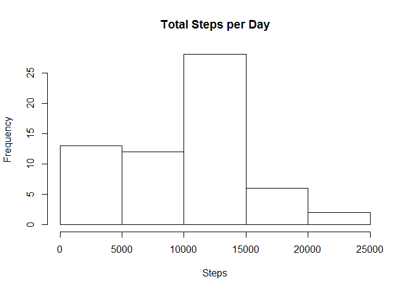
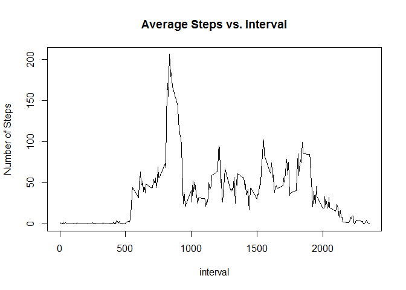

# Reproducible Research: Peer Assessment 1


## Loading and preprocessing the data
First we will load the activity csv data file into R. The data is aggregated into total steps
per day, with NAs discarded.


```r
fitdata <- read.csv("activity.csv")
stepperday <- aggregate(fitdata$steps, by = list("date" = fitdata$date), sum, na.rm = TRUE)
names(stepperday)[2] = "steps"
```


## What is mean total number of steps taken per day?
Let's take a look at the distribution of steps taken per day.

Shown below is a histogram of the total number of steps taken per day. On the x axis is the interval of number of steps taken in a day and on the y axis is how many days fell into each interval.


```r
hist(stepperday$steps, main = "Total Steps per Day", xlab = "Steps")
```

 

The mean and median total number of steps taken per day are found below:


```r
mean(stepperday$steps)
```

```
## [1] 9354.23
```

```r
median(stepperday$steps)
```

```
## [1] 10395
```

## What is the average daily activity pattern?
First we aggregate the data by the five minute interval across all days. This gives us an idea of the average activity at a particular time during any given day.


```r
stepperinterval <- aggregate(fitdata$steps, by = list("interval" = fitdata$interval), mean, na.rm = TRUE)
names(stepperinterval)[2] = "steps"
```

Let's look at the aggregated data. We'll plot a time series plot below with the five-minute intervals on the x-axis and the average number of steps across all days on the y-axis


```r
plot(stepperinterval$interval, stepperinterval$steps, main = "Average Steps vs. Interval", type = "l", xlab = "interval", ylab = "Number of Steps")
```

 

We see a peak of activity at around 0800-0900 hours, probably when this person gets up and goes about their morning routine. We see other peaks, suggestive of a routine that he / she follows. The period of maximum activity can be found simply with the following code bit:


```r
stepperinterval[stepperinterval$step == max(stepperinterval$step), 1]
```

```
## [1] 835
```

## Imputing missing values
By taking a look at the data, we would notice that there are a number of missing data points.
The total number in the original data of NAs is:


```r
sum(is.na(fitdata$steps))
```

```
## [1] 2304
```

Perhaps we could fill in this missing data. The approach I'm going to take is by filling in the missing data with the average number of steps for that five-minute interval averaged across each day. Although it is likely not the best approach, and will compound the sampling error in the data, it is a quick way to get rid of the missing data.


```r
imputeddata <- fitdata
for(i in 1:dim(imputeddata)[1]) {
    if(is.na(imputeddata$steps[i])) {
        imputeddata$steps[i] <- stepperinterval[imputeddata$interval[i]
                                                == stepperinterval$interval, 2]
        }
}
```

We will repeat the analysis done in part one with the new data.


```r
stepperday2 <- aggregate(imputeddata$steps, by = list("date" = imputeddata$date), 
                         sum, na.rm = TRUE)
names(stepperday2)[2] = "steps"
hist(stepperday$steps, main = "Total Steps per Day", xlab = "Steps")
```

 

The general distribution is unchanged. Does the mean or median change? Let's compare the new and the original data


```r
mean(stepperday2$steps)
```

```
## [1] 10766.19
```

```r
median(stepperday2$steps)
```

```
## [1] 10766.19
```

```r
mean(stepperday$steps)
```

```
## [1] 9354.23
```

```r
median(stepperday$steps)
```

```
## [1] 10395
```
## Are there differences in activity patterns between weekdays and weekends?

Let's add in a factor variable which tracks whether the date is a weekday or a weekend, then use this information to see meaningful differences between activity patterns between the two.


```r
imputeddata$Day = weekdays(as.POSIXlt(as.character(imputeddata$date)))
weekdays <- c('Monday', 'Tuesday', 'Wednesday', 'Thursday', 'Friday')
imputeddata$Day <- factor(imputeddata$Day %in% weekdays,
                          levels=c(FALSE, TRUE), labels=c('weekend', 'weekday'))

stepperinterval2 <- aggregate(imputeddata$steps, by = list("interval" = imputeddata$interval, "Day" = imputeddata$Day), mean)
names(stepperinterval2)[3] = "steps"
weekdays <- stepperinterval2[stepperinterval2$Day == 'weekday',]
weekends <- stepperinterval2[stepperinterval2$Day == 'weekend',]
```

Now we're going to make a panel plot with separate 5 minute intervals for weekends and weekdays to see if there is a difference in activity between the two types of days.


```r
par(mfrow=c(2,1))
plot(weekdays$interval, weekdays$steps, main = "Weekdays", type = "l", xlab = "interval", ylab = "Number of Steps")
plot(weekends$interval, weekends$steps, main = "Weekends", type = "l", xlab = "interval", ylab = "Number of Steps")
```

 

We see this person seems to be more active on weekends and wakes up slightly later on weekends, which seems reasonable.
